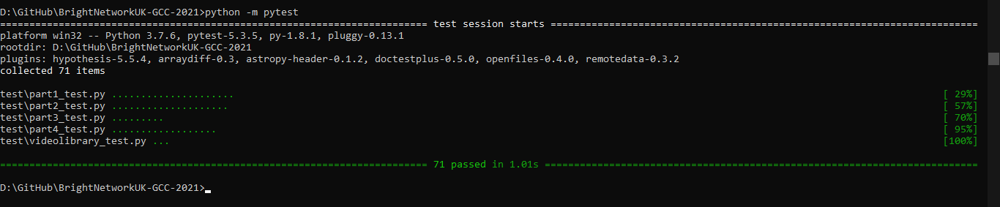

# Google Sample Code, in association with Bright Networks - 2021
This repo is related to Google Coding Challenge, given to Bright Network Internship Experience 2021.
Programming Language: Python.

## Requirements:
- Python 3.7 or higher
- Pytest (to install: pip install pytest)
- IDE (Pycharm)

## Screenshot of all tests passed:

